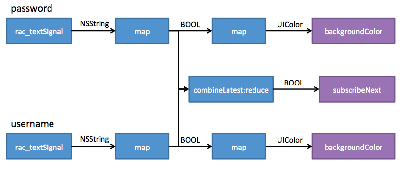
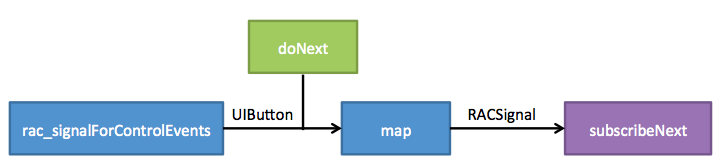

# ReactiveLearn
ReactiveLearn, via Ray Wenderlich

<q>
 It can take a bit of practice to get used to the concepts, but like any language or program, once you get the hang of it it’s really quite simple. At the very core of ReactiveCocoa are signals, which are nothing more than streams of events. What could be simpler than that?

</q>

<ul>
<h3>Github </h3>
 

<li>

<a href="https://github.com/ReactiveCocoa/ReactiveObjC">ReactiveCocoa/ReactiveObjC</a>

</li>

<li>

<a href="https://github.com/ReactiveCocoa/ReactiveObjC/blob/master/Documentation/MemoryManagement.md"> Memory Management</a>
</li>

<li>

<a href="https://github.com/ReactiveCocoa/ReactiveObjC/blob/master/Documentation/DesignGuidelines.md#avoid-explicit-subscriptions-and-disposal">Design Guidelines
 </a>
</li>
<h3>MS Developer Net </h3>
 

<li>

<a href="https://msdn.microsoft.com/library/hh242985.aspx">MSDN: Reactive Extensions</a>

</li>

<li>
<a href="https://blogs.msdn.microsoft.com/rxteam/2010/10/28/rx-design-guidelines/">Rx Design Guidelines</h>

</li>

<h3>Ray Wenderlich </h3>
 

<li>

<a href="https://msdn.microsoft.com/library/hh242985.aspx">ReactiveCocoa Tutorial – The Definitive Introduction: Part 1/2</a>

</li>

</ul>

###  pipeline.
##### It is the very essence of Reactive Programming, where you express your application’s functionality in terms of data flows.

#### Combining signals

 

 

### Tips

#### Formatting of Pipelines

When you’re delving into formatting ReactiveCocoa code, the generally accepted convention is to have each operation on a new line, and align all of the steps vertically.

#### Memory Management

ARC , 信号的 内存管理

### git 操作 :
git push git@dengV:dengV/ReactiveLearn.git
